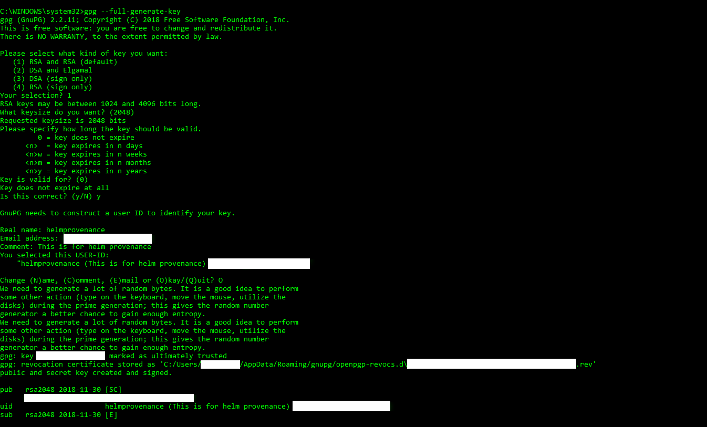
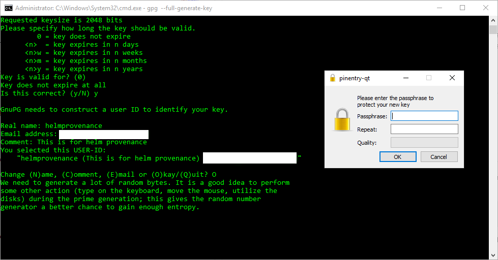
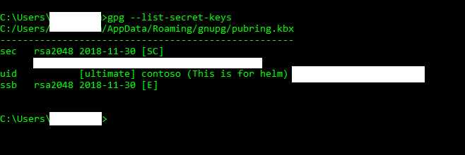
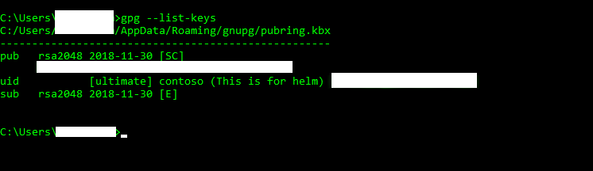

# HelmDeploy@0 - Package and deploy Helm charts v0 task

<!-- :::description::: -->
:::moniker range="<=azure-pipelines"

<!-- :::editable-content name="description"::: -->
Use this task to deploy, configure, or update a Kubernetes cluster in Azure Container Service by running helm commands.
<!-- :::editable-content-end::: -->

:::moniker-end

<!-- :::description-end::: -->

<!-- :::syntax::: -->
## Syntax

:::moniker range=">=azure-pipelines-2022"

```yaml
# Package and deploy Helm charts v0
# Deploy, configure, update a Kubernetes cluster in Azure Container Service by running helm commands.
- task: HelmDeploy@0
  inputs:
  # Kubernetes Cluster
    #connectionType: 'Azure Resource Manager' # 'Azure Resource Manager' | 'Kubernetes Service Connection' | 'None'. Required when command != logout && command != package && command != save. Connection Type. Default: Azure Resource Manager.
    #azureSubscription: # string. Alias: azureSubscriptionEndpoint. Required when connectionType = Azure Resource Manager && command != logout && command != package && command != save. Azure subscription. 
    #azureResourceGroup: # string. Required when connectionType = Azure Resource Manager && command != logout && command != package && command != save. Resource group. 
    #kubernetesCluster: # string. Required when connectionType = Azure Resource Manager && command != logout && command != package && command != save. Kubernetes cluster. 
    #useClusterAdmin: false # boolean. Optional. Use when connectionType = Azure Resource Manager && command != logout && command != package && command != save. Use cluster admin credentials. Default: false.
    #kubernetesServiceConnection: # string. Alias: kubernetesServiceEndpoint. Required when connectionType = Kubernetes Service Connection && command != logout && command != package && command != save. Kubernetes Service Connection. 
    #namespace: # string. Optional. Use when command != logout && command != package && command != save. Namespace. 
  # Azure Container Registry
    #azureSubscriptionForACR: # string. Alias: azureSubscriptionEndpointForACR. Required when command == save. Azure subscription for Container Registry. 
    #azureResourceGroupForACR: # string. Required when command == save. Resource group. 
    #azureContainerRegistry: # string. Required when command == save. Azure Container Registry. 
  # Commands
    command: 'ls' # 'create' | 'delete' | 'expose' | 'get' | 'init' | 'install' | 'login' | 'logout' | 'ls' | 'package' | 'rollback' | 'save' | 'upgrade' | 'uninstall'. Required. Command. Default: ls.
    #chartType: 'Name' # 'Name' | 'FilePath'. Required when command == install || command == upgrade. Chart Type. Default: Name.
    chartName: # string. Required when chartType == Name. Chart Name. 
    #chartPath: # string. Required when chartType == FilePath || command == package. Chart Path. 
    #chartVersion: # string. Alias: version. Optional. Use when command == package || command == install || command == upgrade. Version. 
    #releaseName: # string. Optional. Use when command == install || command == upgrade. Release Name. 
    #overrideValues: # string. Optional. Use when command == install || command == upgrade. Set Values. 
    #valueFile: # string. Optional. Use when command == install || command == upgrade. Value File. 
    #destination: '$(Build.ArtifactStagingDirectory)' # string. Optional. Use when command == package. Destination. Default: $(Build.ArtifactStagingDirectory).
    #canaryimage: false # boolean. Optional. Use when command == init. Use canary image version. Default: false.
    #upgradetiller: true # boolean. Optional. Use when command == init. Upgrade Tiller. Default: true.
    #updatedependency: false # boolean. Optional. Use when command == install || command == package. Update Dependency. Default: false.
    #save: true # boolean. Optional. Use when command == package. Save. Default: true.
    #install: true # boolean. Optional. Use when command == upgrade. Install if release not present. Default: true.
    #recreate: false # boolean. Optional. Use when command == upgrade. Recreate Pods. Default: false.
    #resetValues: false # boolean. Optional. Use when command == upgrade. Reset Values. Default: false.
    #force: false # boolean. Optional. Use when command == upgrade. Force. Default: false.
    #waitForExecution: true # boolean. Optional. Use when command == init || command == install || command == upgrade. Wait. Default: true.
    #arguments: # string. Optional. Use when command != login && command != logout. Arguments. 
    #chartNameForACR: # string. Required when command == save. Chart Name For Azure Container Registry. 
    #chartPathForACR: # string. Required when command == save. Chart Path for Azure Container Registry. 
  # TLS
    #enableTls: false # boolean. Optional. Use when command != login && command != logout && command != package && command != save. Enable TLS. Default: false.
    #caCert: # string. Required when enableTls == true && command != login && command != logout && command != package && command != save. CA certificate. 
    #certificate: # string. Required when enableTls == true && command != login && command != logout && command != package && command != save. Certificate. 
    #privatekey: # string. Required when enableTls == true && command != login && command != logout && command != package && command != save. Key. 
  # Advanced
    #tillernamespace: # string. Optional. Use when command != login && command != logout && command != package && command != save. Tiller namespace. 
    #failOnStderr: false # boolean. Optional. Use when command != login && command != logout && command != package && command != save. Fail on Standard Error. Default: false.
    #publishPipelineMetadata: true # boolean. Optional. Use when command != login && command != logout && command != package && command != save. Publish pipeline metadata. Default: true.
```

:::moniker-end

<!-- :::syntax-end::: -->

<!-- :::inputs::: -->
## Inputs

<!-- :::item name="connectionType"::: -->
:::moniker range="<=azure-pipelines"

**`connectionType`** - **Connection Type**<br>
`string`. Required when `command != logout && command != package && command != save`. Allowed values: `Azure Resource Manager`, `Kubernetes Service Connection`, `None`. Default value: `Azure Resource Manager`.<br>
<!-- :::editable-content name="helpMarkDown"::: -->
Specifies the connection type.

* `Kubernetes Service Connection` - Specify `Kubernetes Service Connection` to connect to any Kubernetes cluster by using `kubeconfig` or the Azure Service Account. Allows you to provide a KubeConfig file, specify a Service Account, or import an AKS instance with the **Azure Subscription** option. Importing an AKS instance with the **Azure Subscription** option requires Kubernetes cluster access at Service Connection configuration time.
* `Azure Resource Manager` - Specify `Azure Resource Manager` to connect to an Azure Kubernetes Service by using Azure Service Connection. Does not access Kubernetes cluster at Service Connection configuration time.
* `None` - Use a pre-created Kubernetes configuration stored locally.

For more information, see [Service connection](#service-connection) in the following [Remarks](#remarks) section.
<!-- :::editable-content-end::: -->
<br>

:::moniker-end

<!-- :::item-end::: -->
<!-- :::item name="azureSubscription"::: -->
:::moniker range="<=azure-pipelines"

**`azureSubscription`** - **Azure subscription**<br>
[Input alias](index.md#what-are-task-input-aliases): `azureSubscriptionEndpoint`. `string`. Required when `connectionType = Azure Resource Manager && command != logout && command != package && command != save`.<br>
<!-- :::editable-content name="helpMarkDown"::: -->
The name of the Azure Service Connection. Specify an Azure subscription that has your container registry.
<!-- :::editable-content-end::: -->
<br>

:::moniker-end

<!-- :::item-end::: -->
<!-- :::item name="azureResourceGroup"::: -->
:::moniker range="<=azure-pipelines"

**`azureResourceGroup`** - **Resource group**<br>
`string`. Required when `connectionType = Azure Resource Manager && command != logout && command != package && command != save`.<br>
<!-- :::editable-content name="helpMarkDown"::: -->
The name of the resource group within the subscription. Specify an Azure Resource Group.
<!-- :::editable-content-end::: -->
<br>

:::moniker-end

<!-- :::item-end::: -->
<!-- :::item name="kubernetesCluster"::: -->
:::moniker range="<=azure-pipelines"

**`kubernetesCluster`** - **Kubernetes cluster**<br>
`string`. Required when `connectionType = Azure Resource Manager && command != logout && command != package && command != save`.<br>
<!-- :::editable-content name="helpMarkDown"::: -->
The name of the AKS cluster. Specify an Azure Managed Cluster.
<!-- :::editable-content-end::: -->
<br>

:::moniker-end

<!-- :::item-end::: -->
<!-- :::item name="useClusterAdmin"::: -->
:::moniker range="<=azure-pipelines"

**`useClusterAdmin`** - **Use cluster admin credentials**<br>
`boolean`. Optional. Use when `connectionType = Azure Resource Manager && command != logout && command != package && command != save`. Default value: `false`.<br>
<!-- :::editable-content name="helpMarkDown"::: -->
Uses cluster administrator credentials instead of default cluster user credentials.
<!-- :::editable-content-end::: -->
<br>

:::moniker-end

<!-- :::item-end::: -->
<!-- :::item name="kubernetesServiceConnection"::: -->
:::moniker range="<=azure-pipelines"

**`kubernetesServiceConnection`** - **Kubernetes Service Connection**<br>
[Input alias](index.md#what-are-task-input-aliases): `kubernetesServiceEndpoint`. `string`. Required when `connectionType = Kubernetes Service Connection && command != logout && command != package && command != save`.<br>
<!-- :::editable-content name="helpMarkDown"::: -->
Specifies a Kubernetes Service Connection.
<!-- :::editable-content-end::: -->
<br>

:::moniker-end

<!-- :::item-end::: -->
<!-- :::item name="namespace"::: -->
:::moniker range="<=azure-pipelines"

**`namespace`** - **Namespace**<br>
`string`. Optional. Use when `command != logout && command != package && command != save`.<br>
<!-- :::editable-content name="helpMarkDown"::: -->
The namespace on which you run the `kubectl` commands. If not specified, the task uses the default namespace. Specify the Kubernetes namespace to use. You can specify the Tiller namespace in the advanced section of the task or by passing the `--tiller-namespace` option as an argument.
<!-- :::editable-content-end::: -->
<br>

:::moniker-end

<!-- :::item-end::: -->
<!-- :::item name="azureSubscriptionForACR"::: -->
:::moniker range="<=azure-pipelines"

**`azureSubscriptionForACR`** - **Azure subscription for Container Registry**<br>
[Input alias](index.md#what-are-task-input-aliases): `azureSubscriptionEndpointForACR`. `string`. Required when `command == save`.<br>
<!-- :::editable-content name="helpMarkDown"::: -->
Specifies an Azure subscription that has your Azure Container Registry.
<!-- :::editable-content-end::: -->
<br>

:::moniker-end
<!-- :::item-end::: -->
<!-- :::item name="azureResourceGroupForACR"::: -->
:::moniker range="<=azure-pipelines"

**`azureResourceGroupForACR`** - **Resource group**<br>
`string`. Required when `command == save`.<br>
<!-- :::editable-content name="helpMarkDown"::: -->
Specifies an Azure Resource Group that has your Container Registry.
<!-- :::editable-content-end::: -->
<br>

:::moniker-end
<!-- :::item-end::: -->
<!-- :::item name="azureContainerRegistry"::: -->
:::moniker range="<=azure-pipelines"

**`azureContainerRegistry`** - **Azure Container Registry**<br>
`string`. Required when `command == save`.<br>
<!-- :::editable-content name="helpMarkDown"::: -->
Specifies an Azure Container Registry to be used for pushing Helm charts.
<!-- :::editable-content-end::: -->
<br>

:::moniker-end
<!-- :::item-end::: -->
<!-- :::item name="command"::: -->
:::moniker range=">=azure-pipelines-2022"

**`command`** - **Command**<br>
`string`. Required. Allowed values: `create`, `delete`, `expose`, `get`, `init`, `install`, `login`, `logout`, `ls`, `package`, `rollback`, `save`, `upgrade`, `uninstall`. Default value: `ls`.<br>
<!-- :::editable-content name="helpMarkDown"::: -->
Specifies a Helm command.
<!-- :::editable-content-end::: -->
<br>

:::moniker-end

<!-- :::item-end::: -->
<!-- :::item name="chartType"::: -->
:::moniker range="<=azure-pipelines"

**`chartType`** - **Chart Type**<br>
`string`. Required when `command == install || command == upgrade`. Allowed values: `Name`, `FilePath` (File Path). Default value: `Name`.<br>
<!-- :::editable-content name="helpMarkDown"::: -->
Specifies how you want to enter chart information. You can either provide the name of the chart or folder/file path to the chart.
<!-- :::editable-content-end::: -->
<br>

:::moniker-end
<!-- :::item-end::: -->
<!-- :::item name="chartName"::: -->
:::moniker range="<=azure-pipelines"

**`chartName`** - **Chart Name**<br>
`string`. Required when `chartType == Name`.<br>
<!-- :::editable-content name="helpMarkDown"::: -->
The name of the chart reference to install. This can be a url or a chart name. For example, if the chart name is `stable/mysql`, the task runs `helm install stable/mysql`.
<!-- :::editable-content-end::: -->
<br>

:::moniker-end
<!-- :::item-end::: -->
<!-- :::item name="chartPath"::: -->
:::moniker range="<=azure-pipelines"

**`chartPath`** - **Chart Path**<br>
`string`. Required when `chartType == FilePath || command == package`.<br>
<!-- :::editable-content name="helpMarkDown"::: -->
The path to the chart to install. This can be a path to a packaged chart or a path to an unpacked chart directory. For example, if you specify `./redis`, the task runs `helm install ./redis`. If you're consuming a chart that's published as an artifact, then the path will be `$(System.DefaultWorkingDirectory)/ARTIFACT-NAME/Charts/CHART-NAME`.
<!-- :::editable-content-end::: -->
<br>

:::moniker-end
<!-- :::item-end::: -->
<!-- :::item name="chartVersion"::: -->
:::moniker range="<=azure-pipelines"

**`chartVersion`** - **Version**<br>
[Input alias](index.md#what-are-task-input-aliases): `version`. `string`. Optional. Use when `command == package || command == install || command == upgrade`.<br>
<!-- :::editable-content name="helpMarkDown"::: -->
Specifies the exact chart version to install. If you don't specify the chart version, the task installs the latest version. Set the version on the chart to this semver version​.
<!-- :::editable-content-end::: -->
<br>

:::moniker-end

<!-- :::item-end::: -->
<!-- :::item name="releaseName"::: -->
:::moniker range="<=azure-pipelines"

**`releaseName`** - **Release Name**<br>
`string`. Optional. Use when `command == install || command == upgrade`.<br>
<!-- :::editable-content name="helpMarkDown"::: -->
The release name. If you don't specify the release name, the task autogenerates one for you. The `releaseName` input is only valid for `install` and `upgrade` commands.
<!-- :::editable-content-end::: -->
<br>

:::moniker-end
<!-- :::item-end::: -->
<!-- :::item name="overrideValues"::: -->
:::moniker range="<=azure-pipelines"

**`overrideValues`** - **Set Values**<br>
`string`. Optional. Use when `command == install || command == upgrade`.<br>
<!-- :::editable-content name="helpMarkDown"::: -->
Specifies values on the command line. This input can specify multiple or separate values with commas: `key1=val1,key2=val2`.

You can also specify multiple values by delimiting them with a new line, as follows:

* key1=val1
* key2=val2

If you have a value that contains new lines, use the `valueFile` option. Otherwise, the task treats the new line as a delimiter. The task constructs the Helm command by using these set values. For example, you can set the value using a command like the following: `helm install --set key1=val1 ./redis`.
<!-- :::editable-content-end::: -->
<br>

:::moniker-end
<!-- :::item-end::: -->
<!-- :::item name="valueFile"::: -->
:::moniker range="<=azure-pipelines"

**`valueFile`** - **Value File**<br>
`string`. Optional. Use when `command == install || command == upgrade`.<br>
<!-- :::editable-content name="helpMarkDown"::: -->
Specifies values in a YAML file or a URL. For example, specifying `myvalues.yaml` results in `helm install --values=myvals.yaml`.
<!-- :::editable-content-end::: -->
<br>

:::moniker-end
<!-- :::item-end::: -->
<!-- :::item name="destination"::: -->
:::moniker range="<=azure-pipelines"

**`destination`** - **Destination**<br>
`string`. Optional. Use when `command == package`. Default value: `$(Build.ArtifactStagingDirectory)`.<br>
<!-- :::editable-content name="helpMarkDown"::: -->
Specifies values in a YAML file or a URL.
<!-- :::editable-content-end::: -->
<br>

:::moniker-end
<!-- :::item-end::: -->
<!-- :::item name="canaryimage"::: -->
:::moniker range="<=azure-pipelines"

**`canaryimage`** - **Use canary image version.**<br>
`boolean`. Optional. Use when `command == init`. Default value: `false`.<br>
<!-- :::editable-content name="helpMarkDown"::: -->
Specifies the canary Tiller image. Use the latest pre-release version of Tiller.
<!-- :::editable-content-end::: -->
<br>

:::moniker-end
<!-- :::item-end::: -->
<!-- :::item name="upgradetiller"::: -->
:::moniker range="<=azure-pipelines"

**`upgradetiller`** - **Upgrade Tiller**<br>
`boolean`. Optional. Use when `command == init`. Default value: `true`.<br>
<!-- :::editable-content name="helpMarkDown"::: -->
If `true`, this input upgrades Tiller if Tiller is already installed.
<!-- :::editable-content-end::: -->
<br>

:::moniker-end
<!-- :::item-end::: -->
<!-- :::item name="updatedependency"::: -->
:::moniker range="<=azure-pipelines"

**`updatedependency`** - **Update Dependency**<br>
`boolean`. Optional. Use when `command == install || command == package`. Default value: `false`.<br>
<!-- :::editable-content name="helpMarkDown"::: -->
If `true`, this input updates a Helm dependency update before installing the chart. Updates dependencies from `requirements.yaml` to the `charts/` directory before packaging.
<!-- :::editable-content-end::: -->
<br>

:::moniker-end
<!-- :::item-end::: -->
<!-- :::item name="save"::: -->
:::moniker range="<=azure-pipelines"

**`save`** - **Save**<br>
`boolean`. Optional. Use when `command == package`. Default value: `true`.<br>
<!-- :::editable-content name="helpMarkDown"::: -->
Saves the packaged chart to the local chart repository when set to `true​`.
<!-- :::editable-content-end::: -->
<br>

:::moniker-end
<!-- :::item-end::: -->
<!-- :::item name="install"::: -->
:::moniker range="<=azure-pipelines"

**`install`** - **Install if release not present.**<br>
`boolean`. Optional. Use when `command == upgrade`. Default value: `true`.<br>
<!-- :::editable-content name="helpMarkDown"::: -->
If a release by this name doesn't already exist, this input runs an install​.
<!-- :::editable-content-end::: -->
<br>

:::moniker-end
<!-- :::item-end::: -->
<!-- :::item name="recreate"::: -->
:::moniker range="<=azure-pipelines"

**`recreate`** - **Recreate Pods.**<br>
`boolean`. Optional. Use when `command == upgrade`. Default value: `false`.<br>
<!-- :::editable-content name="helpMarkDown"::: -->
Performs pods restart for the resource, if applicable.
<!-- :::editable-content-end::: -->
<br>

:::moniker-end
<!-- :::item-end::: -->
<!-- :::item name="resetValues"::: -->
:::moniker range="<=azure-pipelines"

**`resetValues`** - **Reset Values.**<br>
`boolean`. Optional. Use when `command == upgrade`. Default value: `false`.<br>
<!-- :::editable-content name="helpMarkDown"::: -->
Resets the values to the values built into the chart.
<!-- :::editable-content-end::: -->
<br>

:::moniker-end
<!-- :::item-end::: -->
<!-- :::item name="force"::: -->
:::moniker range="<=azure-pipelines"

**`force`** - **Force**<br>
`boolean`. Optional. Use when `command == upgrade`. Default value: `false`.<br>
<!-- :::editable-content name="helpMarkDown"::: -->
Forces a resource update through a delete or recreate action, if needed​.
<!-- :::editable-content-end::: -->
<br>

:::moniker-end
<!-- :::item-end::: -->
<!-- :::item name="waitForExecution"::: -->
:::moniker range="<=azure-pipelines"

**`waitForExecution`** - **Wait**<br>
`boolean`. Optional. Use when `command == init || command == install || command == upgrade`. Default value: `true`.<br>
<!-- :::editable-content name="helpMarkDown"::: -->
Blocks the action until the command execution completes.
<!-- :::editable-content-end::: -->
<br>

:::moniker-end
<!-- :::item-end::: -->
<!-- :::item name="arguments"::: -->
:::moniker range="<=azure-pipelines"

**`arguments`** - **Arguments**<br>
`string`. Optional. Use when `command != login && command != logout`.<br>
<!-- :::editable-content name="helpMarkDown"::: -->
The Helm command options.
<!-- :::editable-content-end::: -->
<br>

:::moniker-end
<!-- :::item-end::: -->
<!-- :::item name="enableTls"::: -->
:::moniker range="<=azure-pipelines"

**`enableTls`** - **Enable TLS**<br>
`boolean`. Optional. Use when `command != login && command != logout && command != package && command != save`. Default value: `false`.<br>
<!-- :::editable-content name="helpMarkDown"::: -->
Enables using SSL between Helm and Tiller.
<!-- :::editable-content-end::: -->
<br>

:::moniker-end

<!-- :::item-end::: -->
<!-- :::item name="caCert"::: -->
:::moniker range="<=azure-pipelines"

**`caCert`** - **CA certificate**<br>
`string`. Required when `enableTls == true && command != login && command != logout && command != package && command != save`.<br>
<!-- :::editable-content name="helpMarkDown"::: -->
The CA cert used to issue a certificate for the Tiller and Helm client.
<!-- :::editable-content-end::: -->
<br>

:::moniker-end

<!-- :::item-end::: -->
<!-- :::item name="certificate"::: -->
:::moniker range="<=azure-pipelines"

**`certificate`** - **Certificate**<br>
`string`. Required when `enableTls == true && command != login && command != logout && command != package && command != save`.<br>
<!-- :::editable-content name="helpMarkDown"::: -->
Specify the Tiller certificate or the Helm client certificate.
<!-- :::editable-content-end::: -->
<br>

:::moniker-end

<!-- :::item-end::: -->
<!-- :::item name="privatekey"::: -->
:::moniker range="<=azure-pipelines"

**`privatekey`** - **Key**<br>
`string`. Required when `enableTls == true && command != login && command != logout && command != package && command != save`.<br>
<!-- :::editable-content name="helpMarkDown"::: -->
Specify the Tiller key or the Helm client key.
<!-- :::editable-content-end::: -->
<br>

:::moniker-end

<!-- :::item-end::: -->
<!-- :::item name="tillernamespace"::: -->
:::moniker range="<=azure-pipelines"

**`tillernamespace`** - **Tiller namespace**<br>
`string`. Optional. Use when `command != login && command != logout && command != package && command != save`.<br>
<!-- :::editable-content name="helpMarkDown"::: -->
Specify Tiller's Kubernetes namespace.
<!-- :::editable-content-end::: -->
<br>

:::moniker-end

<!-- :::item-end::: -->
<!-- :::item name="failOnStderr"::: -->
:::moniker range="<=azure-pipelines"

**`failOnStderr`** - **Fail on Standard Error**<br>
`boolean`. Optional. Use when `command != login && command != logout && command != package && command != save`. Default value: `false`.<br>
<!-- :::editable-content name="helpMarkDown"::: -->
If this input is `true`, this task fails if any errors are written to the error pipeline, or if any data is written to the Standard Error stream. Otherwise, the task relies on the exit code to determine failure.
<!-- :::editable-content-end::: -->
<br>

:::moniker-end

<!-- :::item-end::: -->
<!-- :::item name="publishPipelineMetadata"::: -->
:::moniker range="<=azure-pipelines"

**`publishPipelineMetadata`** - **Publish pipeline metadata**<br>
`boolean`. Optional. Use when `command != login && command != logout && command != package && command != save`. Default value: `true`.<br>
<!-- :::editable-content name="helpMarkDown"::: -->
If this input is `true`, the task collects and publishes deployment metadata.
<!-- :::editable-content-end::: -->
<br>

:::moniker-end
<!-- :::item-end::: -->
<!-- :::item name="chartNameForACR"::: -->
:::moniker range="<=azure-pipelines"

**`chartNameForACR`** - **Chart Name For Azure Container Registry**<br>
`string`. Required when `command == save`.<br>
<!-- :::editable-content name="helpMarkDown"::: -->
The chart's name in the Azure Container Registry.
<!-- :::editable-content-end::: -->
<br>

:::moniker-end
<!-- :::item-end::: -->
<!-- :::item name="chartPathForACR"::: -->
:::moniker range="<=azure-pipelines"

**`chartPathForACR`** - **Chart Path for Azure Container Registry**<br>
`string`. Required when `command == save`.<br>
<!-- :::editable-content name="helpMarkDown"::: -->
The file path to the chart directory in the Azure Container Registry.
<!-- :::editable-content-end::: -->
<br>

:::moniker-end
<!-- :::item-end::: -->

### Task control options

All tasks have control options in addition to their task inputs. For more information, see [Control options and common task properties](/azure/devops/pipelines/yaml-schema/steps-task#common-task-properties).
<!-- :::inputs-end::: -->

<!-- :::outputVariables::: -->
## Output variables

:::moniker range="<=azure-pipelines"

This task defines the following [output variables](/azure/devops/pipelines/process/variables#use-output-variables-from-tasks), which you can consume in downstream steps, jobs, and stages.

<!-- :::item name="helmExitCode"::: -->
**`helmExitCode`**<br><!-- :::editable-content name="Value"::: -->
The exit code emitted from the execution of specified Helm command.
<!-- :::editable-content-end::: -->
<!-- :::item-end::: -->
<!-- :::item name="helmOutput"::: -->
**`helmOutput`**<br><!-- :::editable-content name="Value"::: -->
The output emitted from the execution of specified Helm command.
<!-- :::editable-content-end::: -->
<!-- :::item-end::: -->

:::moniker-end

<!-- :::outputVariables-end::: -->

<!-- :::remarks::: -->
<!-- :::editable-content name="remarks"::: -->
## Remarks

Use HelmDeploy@0 to deploy, configure, or update a Kubernetes cluster in Azure Container Service by running Helm commands.
Helm is a tool that streamlines deploying and managing Kubernetes apps using a packaging format called
charts.

You can define, version, share, install, and upgrade even the most complex Kubernetes app by using Helm.

* Helm helps you combine multiple Kubernetes manifests (yaml) such as service, deployments, configmaps, and more into a single unit called Helm Charts. You don't need to either invent or use a tokenization or a templating tool.
* Helm Charts help you manage application dependencies and deploy as well as rollback as a unit. They are also easy to create, version, publish, and share with other partner teams.

Azure Pipelines has built-in support for Helm charts:

* The [Helm Tool installer task](helm-installer-v1.md) can be used to install the correct version of Helm onto the agents.
* The Helm package and deploy task can be used to package the app and deploy it to a Kubernetes cluster. 
  You can use the task to install or update Tiller to a Kubernetes namespace, to securely connect to Tiller over TLS for deploying charts,
  or to run any Helm command such as **lint**.
* The Helm task supports connecting to an Azure Kubernetes Service by using an Azure service connection.
  You can connect to any Kubernetes cluster by using **kubeconfig** or a service account.
* Helm deployments can be supplemented by using the **Kubectl** task; for example, create/update, imagepullsecret, and others.

### Service connection

HelmDeploy@0 works with two service connection types: **Azure Resource Manager** and **Kubernetes Service Connection**. See [Examples](#examples) for examples on configuring these two connection types.

> [!NOTE]
> A service connection isn't required if an environment resource that points to a Kubernetes cluster has already been specified in the pipeline's stage.

[!INCLUDE [kubernetes-service-connection](./includes/kubernetes-service-connection.md)]

### Command values

The command input accepts one of the following [helm commands](https://v2-14-0.helm.sh/docs/helm/): create/delete/expose/get/init/install/login/logout/ls/package/rollback/upgrade. Examples are provided in the [Examples](#examples) section.

Each command input maps to a set of task inputs. The commands that map to a task input are designated in the YAML syntax block and in the task inputs table

### Troubleshooting

#### HelmDeploy task throws error 'unknown flag: --wait' while running 'helm init --wait --client-only' on Helm 3.0.2 version.

There are some breaking changes between Helm 2 and Helm 3. One of them includes removal of tiller, and hence `helm init` command is no longer supported. Remove command: init when you use Helm 3.0+ versions.

#### When using Helm 3, if System.debug is set to true and Helm upgrade is the command being used, the pipeline fails even though the upgrade was successful.

This is a known issue with Helm 3, as it writes some logs to stderr. Helm Deploy Task is marked as failed if there are logs to stderr or exit code is non-zero. Set the task input failOnStderr: false to ignore the logs printed to stderr.
<!-- :::editable-content-end::: -->
<!-- :::remarks-end::: -->

<!-- :::examples::: -->
<!-- :::editable-content name="examples"::: -->
## Examples

### Azure Resource Manager

This YAML example shows how Azure Resource Manager is used to refer to the Kubernetes cluster.
This is used with one of the helm [commands](#commands) and the appropriate values required for the command:

```YAML
variables:
  azureSubscriptionEndpoint: Contoso
  azureContainerRegistry: contoso.azurecr.io
  azureResourceGroup: Contoso
  kubernetesCluster: Contoso

- task: HelmDeploy@0
  displayName: Helm deploy
  inputs:
    connectionType: Azure Resource Manager
    azureSubscriptionEndpoint: $(azureSubscriptionEndpoint)
    azureResourceGroup: $(azureResourceGroup)
    kubernetesCluster: $(kubernetesCluster)
```

### Kubernetes Service Connection

This YAML example shows how Kubernetes service connection is used to refer to the Kubernetes cluster.
This is used with one of the helm [commands](#commands) and the appropriate values required for the command:

```YAML
- task: HelmDeploy@0
  displayName: Helm deploy
  inputs:
    connectionType: Kubernetes Service Connection
    kubernetesServiceEndpoint: Contoso
```

### Commands

The command input accepts one of the following [helm commands](https://v2-14-0.helm.sh/docs/helm/): create/delete/expose/get/init/install/login/logout/ls/package/rollback/upgrade.

This YAML example demonstrates the **ls** command:

```YAML
- task: HelmDeploy@0
  displayName: Helm list
  inputs:
    azureSubscriptionEndpoint: $(azureSubscriptionEndpoint)
    azureResourceGroup: $(azureResourceGroup)
    kubernetesCluster: $(kubernetesCluster)
    command: ls
    arguments: --all
```

### init command

This YAML example demonstrates the **init** command:

```YAML
- task: HelmDeploy@0
  displayName: Helm init
  inputs:
    azureSubscriptionEndpoint: $(azureSubscriptionEndpoint)
    azureResourceGroup: $(azureResourceGroup)
    kubernetesCluster: $(kubernetesCluster)
    command: init
    upgradetiller: true
    waitForExecution: true
    arguments: --client-only
```

### install command

This YAML example demonstrates the **install** command:

```YAML
- task: HelmDeploy@0
  displayName: Helm install
  inputs:
    azureSubscriptionEndpoint: $(azureSubscriptionEndpoint)
    azureResourceGroup: $(azureResourceGroup)
    kubernetesCluster: $(kubernetesCluster)
    command: install
    chartType: FilePath
    chartPath: Application/charts/sampleapp
```

### package command

This YAML example demonstrates the **package** command:

```YAML
- task: HelmDeploy@0
  displayName: Helm package
  inputs:
    command: package
    chartPath: Application/charts/sampleapp
    destination: $(Build.ArtifactStagingDirectory)
```

### upgrade command

This YAML example demonstrates the **upgrade** command:

```YAML
- task: HelmDeploy@0
  displayName: Helm upgrade
  inputs:
    azureSubscriptionEndpoint: $(azureSubscriptionEndpoint)
    azureResourceGroup: $(azureResourceGroup)
    kubernetesCluster: $(kubernetesCluster)
    command: upgrade
    chartType: filepath
    chartPath: $(Build.ArtifactStagingDirectory)/sampleapp-v0.2.0.tgz
    releaseName: azuredevopsdemo
    install: true
    waitForExecution: false
```

### save command

This YAML example demonstrates the **save** command:

```YAML
- task: HelmDeploy@0
  displayName: Helm save
  inputs:
    command: save
    chartNameForACR: mycontainerregistry.azurecr.io/helm/hello-world:v1
    chartPathForACR: Application/charts/sampleapp
    azureSubscriptionEndpointForACR: $(azureSubscriptionEndpointForACR)
    azureResourceGroupForACR: $(azureResourceGroupForACR)
    azureContainerRegistry: $(azureContainerRegistry)
```

::: moniker range="azure-pipelines"

### Package and sign Helm charts

In this section you'll learn how to package and sign Helm charts in a pipeline.

#### Generate a private-public key pair to sign the helm chart using GPG

1. Download [GPG](https://www.gnupg.org/download/index.html).

2. Launch the command prompt in an administrator mode. Run the following command to generate a private-public key pair to sign the helm chart using gpg. While creating the key, you'll be prompted for the username and email address. The "name email address" is later used to name the private-public key pair that is created.

   ```cmd
   gpg --full-generate-key
   ```
   
   

3. You'll be prompted for the passphrase. Give the value and click ok.

   

4. After creating the key, you can see the list of keys which contains both private and public using the following command.

   - To see list of private keys

     ```cmd
     gpg --list-secret-keys
     ```

     

   - To see the list of public keys

     ```cmd
     gpg --list-keys
     ```

       

5. Store the private and public keys in 2 different files with the extension **gpg** as shown below.

   * For a private key

   ```cmd
   gpg --export-secret-key AA11BB22CC33DD44EE55FF66AA77BB88CC99DD00 contoso@microsoft.com > C:/somepath/privatekeys.gpg
   ```

   You'll see the **privatekeys.gpg** file exported to the path which was mentioned above.

   * For a public key

   ```cmd
   gpg --export-key AA11BB22CC33DD44EE55FF66AA77BB88CC99DD00 contoso@microsoft.com > C:/somepath/publickey.gpg
   ```

   You'll see the **publickey.gpg** file exported to the path which was mentioned above.

In Azure DevOps, save the **privatekey.gpg** file in the library **secure files** section.

#### Example

```YAML
pool:
  name: Hosted Ubuntu 1604

variables:
  # The below variable should be secure
  HelmKeyPassphrase: contoso@123
  keyName: contoso contoso@microsoft.com
  azureSubscriptionEndpoint: contoso
  azureResourceGroup: contoso
  kubernetesCluster: contoso

steps:
- task: DownloadSecureFile@1
  displayName: Download Secure file
  inputs:
    secureFile: privatekey.gpg
  name: privateKeyRing

- task: HelmInstaller@0
  displayName: Install Helm 2.12.0
  inputs:
    helmVersion: 2.12.0

- task: HelmDeploy@0
  displayName: helm init
  inputs:
    azureSubscriptionEndpoint: $(azureSubscriptionEndpoint)
    azureResourceGroup: $(azureResourceGroup)
    kubernetesCluster: $(kubernetesCluster)
    command: init
    arguments: --client-only

- task: HelmDeploy@0
  displayName: helm package
  inputs:
    command: package
    chartPath: Application/charts/sampleapp
    arguments: --sign --key "$(keyName)" --keyring $(privateKeyRing.secureFilePath)
  env:
    HelmKeyPassphrase: $(HelmKeyPassphrase)
```

::: moniker-end
<!-- :::editable-content-end::: -->
<!-- :::examples-end::: -->

<!-- :::properties::: -->
## Requirements

:::moniker range="<=azure-pipelines"

| Requirement | Description |
|-------------|-------------|
| Pipeline types | YAML, Classic build, Classic release |
| Runs on | Agent, DeploymentGroup |
| [Demands](/azure/devops/pipelines/process/demands) | None |
| [Capabilities](/azure/devops/pipelines/agents/agents#capabilities) | This task does not satisfy any demands for subsequent tasks in the job. |
| [Command restrictions](/azure/devops/pipelines/security/templates#agent-logging-command-restrictions) | Any |
| [Settable variables](/azure/devops/pipelines/security/templates#agent-logging-command-restrictions) | Any |
| Agent version | All supported agent versions. |
| Task category | Deploy |

:::moniker-end
<!-- :::properties-end::: -->

<!-- :::see-also::: -->
<!-- :::editable-content name="seeAlso"::: -->
<!-- :::editable-content-end::: -->
<!-- :::see-also-end::: -->